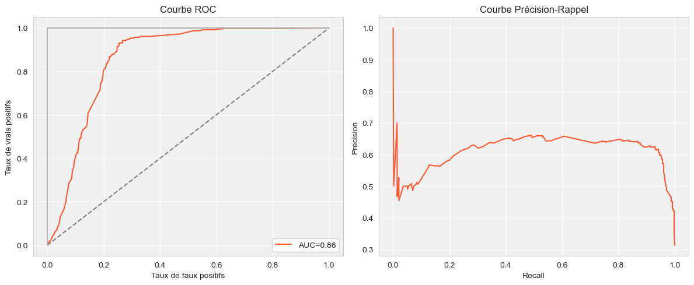

# NLP Project: Householder prediction

Project carried out as part of the "Maching Learning for Natural Language Porcessing" course (ENSAE, 2024).

## Table of Contents
- [Introduction](#introduction)
- [Features](#features)
- [Getting Started](#getting-started)
  - [Prerequisites](#prerequisites)
  - [Installation](#installation)
- [Dataset](#dataset)
- [Experiment](#experiment)
- [Results](#results)

## Introduction

The Socface project brings together archivists, demographers and computer scientists to analyze French census documents and extract information on a very large scale. The aim is to collect and process all handwritten nominal census lists from 1836 to 1936, using automatic handwriting recognition.
Produced every five years, these lists are organized spatially (commune; neighborhoods, hamlets or streets; houses; households) and summarize census information, listing each individual with certain characteristics, such as name, year of birth or occupation.
The project aims to leverage this archival material to produce a database of all individuals who lived in France between 1836 and 1936, which will be used to analyze social change over a 100-year period. A major impact of Socface will be public access to the nominative lists: they will be made available free of charge, enabling anyone to browse through hundreds of millions of records.
Here, we focus on the prediction of the head of household from census data converted into textual form.

## Features

- `estimation_population.ipynb`: estimate the size of the target population by webscrapping the table [link](https://fr.wikipedia.org/wiki/Histoire_d%C3%A9mographique_de_la_France)
- `descriptive_analysis.ipynb`: descriptive statistics on the census data sample
- `main.ipynb`: data processing and model import for head of household prediction
- `src`: package of the proposed solution

## Getting Started

### Prerequisites

- Python (>=3.6)
- Other dependencies (specified in `requirements.txt`)

### Installation

```bash
git clone https://github.com/yanisrem/NLP-Project
cd src
pip install -r requirements.txt
```

## Dataset

The sample corresponds to an extract of census data extracted between 1836 and 1936. Overall, we have 1,218 register pages and $n = 25,448$ individuals. The data are presented in textual form.
They can be split into two parts:
* Individuals for whom the family relationship is specified
* Individuals for whom the family relationship is not specified

## Experiment

For individuals for whom the family relationship is specified we use a regex patterns to detect if they are householders or not.
For the others, we extract age, birth date, nationality ans civil status from text and use a XGBoost classifier.

## Results
Balanced accuracy is 92% on the test set.

<div style="text-align:center;">
  
</div>
